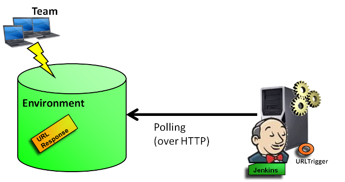
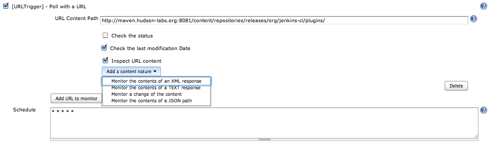

# UrlTrigger Plugin

URLTrigger plug-in makes it possible to monitor changes of the response
got from an URL invocation.

## Features

Jenkins can be configured to poll URL changes.  
The plug-in makes it possible to check the last modification date
response and the response content of a URL invocation.  
For the response content, you can check:

-   a simple response content (the content nature is not interpreted; a
    MD5 is used)
-   a TXT response content (the returned values from the evaluation of
    regular expressions are checked)
-   an XML response content (the returned values from the evaluation of
    XPath expressions are checked)
-   a JSON response content (the returned values from the evaluation of
    JSONPath expressions are checked)



# Some Use cases

* Enables users to check if new artifacts (such as
binaries) have been deployed in a repository (managed for example by a
repository manager such as Sonatype Nexus, JFrog Artifactory, Apache
Archiva and so on).
* Know if a stage of a pipeline (for a
continuous testing, a continous delivery or a continuous deployment) has
to be executed.

# Known Limitations

Only http(s) and ftp URLs are supported. For non-http protocols,
consider other XTrigger plugins such as the [FSTrigger
Plugin](https://plugins.jenkins.io/fstrigger/)

# Configuration



## Notes

To determine the URL caused invocation - use the environment variable
`URL_TRIGGER_CAUSE` - e.g. `${env.URL_TRIGGER_CAUSE}`

To determine the response caused invocation - use the environment variable
`URL_TRIGGER_RESPONSE` - e.g. `${env.URL_TRIGGER_RESPONSE}`

## Declarative Pipeline Syntax
Example:

```groovy
pipeline {
    
    agent any
    
    triggers {
    
        URLTrigger( 
            cronTabSpec: '* * * * *',
            entries: [
                URLTriggerEntry( 
                    url: 'http://www.mysite.com/jsoncontent',
                    username: 'myuser',
                    password: 'mypassword',
                    checkETag: false,
                    checkStatus: true,
                    statusCode: 403,
                    checkLastModificationDate: true,
                    timeout: 200,
                    requestHeaders: [
                        RequestHeader( headerName: "Accept" , headerValue: "application/json" )
                    ],
                    contentTypes: [
                        JsonContent(
                            [
                                JsonContentEntry( jsonPath: 'level1.level2.level3' )
                            ])
                    ]
                ),
                URLTriggerEntry( 
                    url: 'http://www.mysite.com/xmlcontent',
                    requestHeaders: [
                        RequestHeader( headerName: "Accept" , headerValue: "application/xml" )
                    ],
                    contentTypes: [
                        XMLContent(
                            [
                                XMLContentEntry( xPath: 'level1/level2/level3' )
                            ])
                    ]
                ),
                URLTriggerEntry( 
                    url: 'http://www.mysite.com/textcontent',
                    contentTypes: [
                        TextContent(
                            [
                                TextContentEntry( regEx: "Hello.*" ),
                                TextContentEntry( regEx: "Goodbye.*" )
                            ])
                    ]
                ),
                URLTriggerEntry( 
                    url: 'http://www.mysite.com/generalcontent',
                    contentTypes: [
                        MD5Sum()
                    ]
                )
            ]
        )
    }
    stages {
        stage( "Default stage" ) {
            steps {
                echo "This is a stage"
            }
        }
    }
}
```
